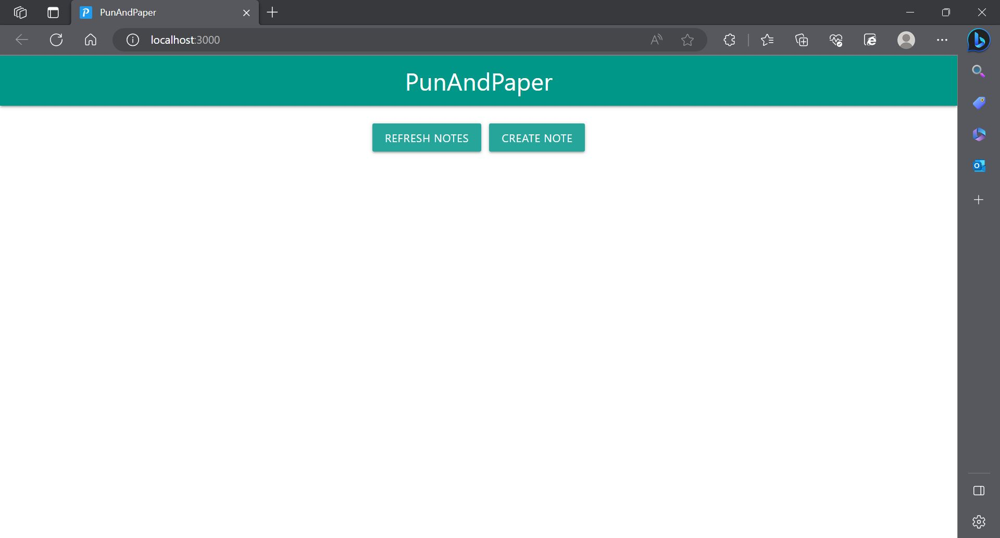
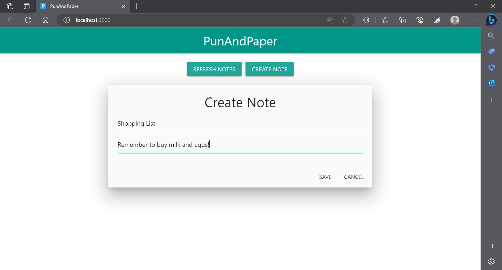
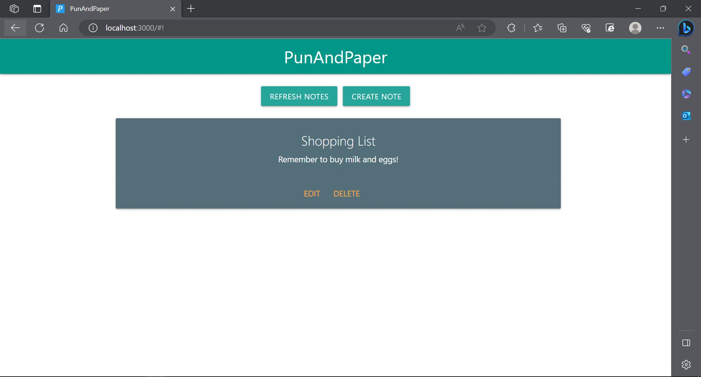
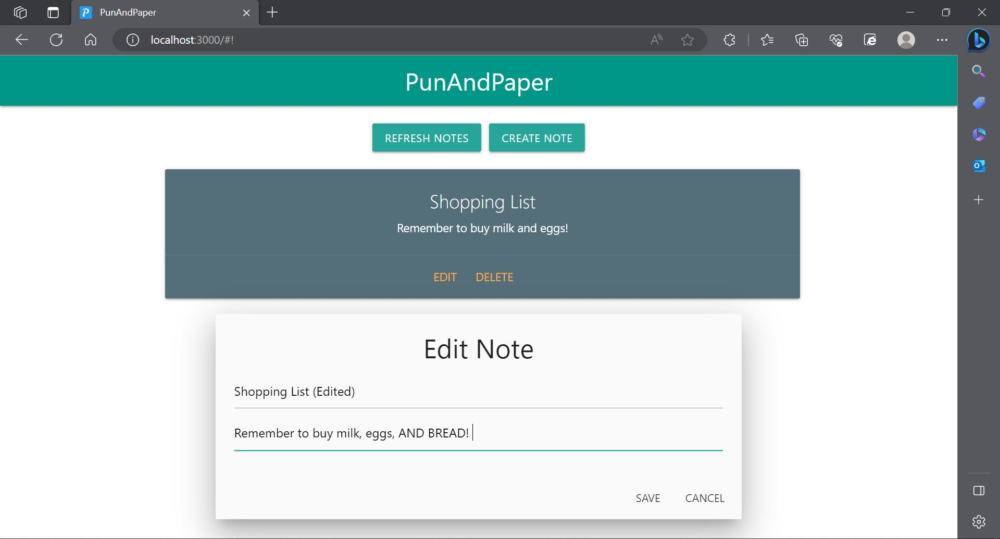
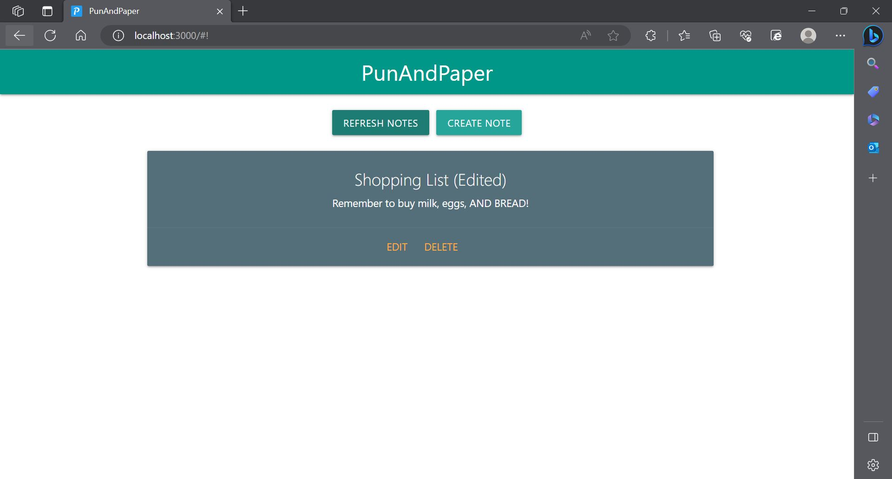
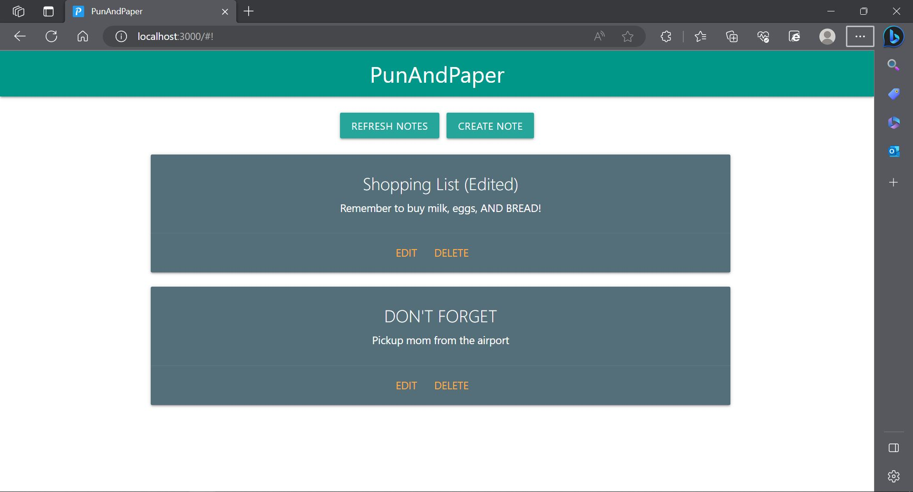

# Hello

This is PunAndPaper, a note taking web application frontend built using ReactJS and Materialize. It communicates with the backend using the Fetch API. 

It was designed to work with my other repository, PunAndPaper-Backend. So make sure you install and run that too!

It also includes a mock service layer if you wish to run this frontend on its own without a backend. Simply modify the code imports from the regular service file to the mock version. It is a mockup of an in-memory key-value database.

# How it looks

This is how it looks like in action.

The start screen:

(There is no need to press "REFRESH NOTES" at all, the page will update whenever any changes to the notes are made! It is there as a backup in the event a desync happens with the backend.)

Creating a note:


The note is created:


Editing the note:


The note is edited:


Multiple notes:


# How to use

After ```npm i```, use ```npm start```\
Open [http://localhost:3000](http://localhost:3000) to view it in your browser.

Alternatively, you can use ```npm run build``` to compile the code to a `build` folder, and run it from there.